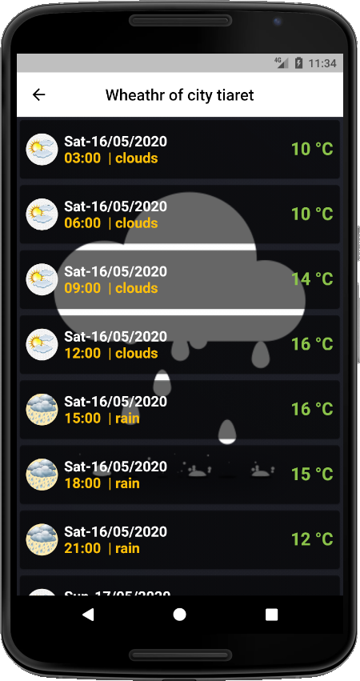

# weather ☁⛅⛈🌤🌥🌦🌧🌨🌩🌪🌫🌝❄

Flutter Weather Application 📱 💡. Current 📍 weather ⛅⛈🌤 and forecasts in your city 🌎🗺.

Get current  📍 weather ⛅⛈🌤, daily forecast for your city🌎🗺


## Screenshots
Home page           | Select your city
:---------------------:|:------------------:
 | 
Result  ( Weather of city selected )           |  Gif (Weather of city)
 | 

Youtube: https://www.youtube.com/watch?v=jaKGsoVRw4E

# Getting Started

This project is a Flutter application that allows us to see the weather conditions, after determining the city and thus returns you with a list showing the weather conditions at the expense of time.

Some resources to get started with such a Flutter project:
- [Lab: Write your first Flutter app](https://flutter.dev/docs/get-started/codelab)
- [Cookbook: Useful Flutter samples](https://flutter.dev/docs/cookbook)
- [Data & backend](https://flutter.dev/docs/development/data-and-backend/networking)
- [Networking](https://flutter.dev/docs/development/data-and-backend/networking)
- [JSON and serialization](https://flutter.dev/docs/development/data-and-backend/json)

For help getting started with Flutter, view our
[online documentation](https://flutter.dev/docs), which offers tutorials,
samples, guidance on mobile development, and a full API reference.
# Weather Flutter

## Features
* [x] Simple to use 
* [x] Get current weather, daily forecast for 16 days, 
* [x] 3-hourly forecast 5 days for your city.
* [x] Helpful stats, graphics, and this day in history charts are available for your reference.
* [x] Interactive maps show precipitation, clouds, pressure, wind around your location.


## Requirements
* Dart
* Flutter
* Internet connection
* key of https://openweathermap.org/


# Installing

### 1. Depend on it
Add this to your package's `pubspec.yaml` file:

 * http
 * intl
 *  cupertino_icons: ^0.1.2

```yaml
dependencies:
  sdk: flutter
             http: ^0.12.1
             intl:
             cupertino_icons: ^0.1.2
```

### 2. Install it

You can install packages from the command line:

with `pub`:

```css
$ pub get
```

with `Flutter`:

```css
$ flutter packages get
```

### 3. Import it

Now in your `Dart` code, you can use: 

```dart
import 'package:flutter/cupertino.dart';
import 'package:flutter/material.dart';
import 'package:http/http.dart' as http;
import 'package:intl/intl.dart';
```

## Installation  this repository
1. Download the repository files (project) from the download section or clone this project by typing in the bash the following command:

       git clone https://github.com/djamelzerrouki/Weather-Flutter.git
2. Import it in Android studio or any other Flutter IDE and let Gradle download the required dependencies for you.
3. Run the application :D

## Contributing 💡
If you want to contribute to this project and make it better with new ideas, your pull request is very welcomed.
If you find any issue just put it in the repository issue section, thank you.

## Contact me
Email: djameljimmizerrouki@gmail.com  
LinkedIn: [DjamelZerrouki](https://www.linkedin.com/in/djamel-zerrouki-0785b6161/)  
Twitter: [@DjamelZerrouki](https://twitter.com/DjamelZerrouki5)

